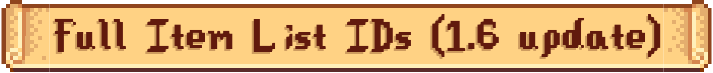
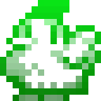

<h1 align="center">
    </img>
</h1>
<p align="center">🐣 Full Stardew Valley item list IDs (updated for 1.6.14) & assets patcher.</p>

<p align="center">
  <a aria-label="Node version" href="https://github.com/nodejs/node/releases/tag/v20.11.1">
    </img>
  </a>
  <a aria-label="Pug version" href="https://github.com/pugjs/pug/releases/tag/pug%403.0.2">
    </img>
  </a>
  </img>
</p>

## 🐓 Stardew Valley Vanilla IDs

<p align="left">
  <a target="_blank" href="https://mateusaquino.github.io/stardewids/"></a>
</p>

This is a tool developed to help you find the IDs of items in Stardew Valley updated for the 1.6 update. It programmatically compiles all [unpacked assets](https://github.com/Pathoschild/StardewXnbHack) to generate a standardized item list separated by item type.

With these both new 1.6 changes:

- [Unique string IDs](https://stardewvalleywiki.com/Modding:Migrate_to_Stardew_Valley_1.6#Unique_string_IDs)
- [New gender replacer dialogue command](https://stardewvalleywiki.com/Modding:Migrate_to_Stardew_Valley_1.6#:~:text=Added%20new%20dialogue%20commands,male%20or%20female)

It's now possible to spawn any item in the game, however, some of the items IDs are too big. Now we can [bypass](https://www.reddit.com/r/StardewValley/comments/12hec5j/item_code_name_limit_bypass/) the pet's textbox width limit without breaking the item ID using the new gender replacer dialogue command, therefore, you can use it to **every single item** in the game.

The tool is currently being hosted at: https://mateusaquino.github.io/stardewids/

## 🚀 Getting Started

If you want to use the patched data files generated by this tool, all data is available at `/dist` folder, however, if you want to update the item lists by yourself (for newer updates) first clone the repository and install the dependencies:

```nginx
git clone https://github.com/MateusAquino/stardewids.git
cd stardewids
npm install
```

Then, you'll need to copy stardew valley [unpacked files](https://github.com/Pathoschild/StardewXnbHack) to `/assets` folder. Patching the items can be done by running:

```nginx
npm run update-item-list
```

This will patch all the items in the game to the `/dist` folder separated by item type.

To generate/update the `index.html` page with all the IDs as you change the files, run:

```nginx
npm run dev
```

Or (for production):

```nginx
npm run build
```
